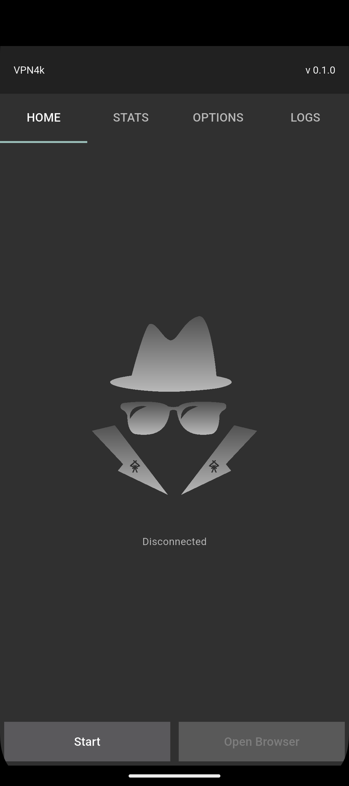
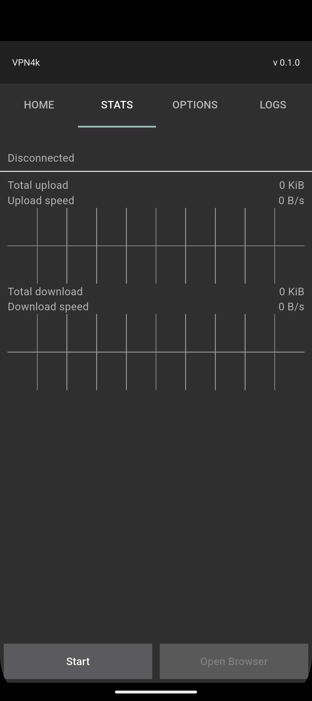
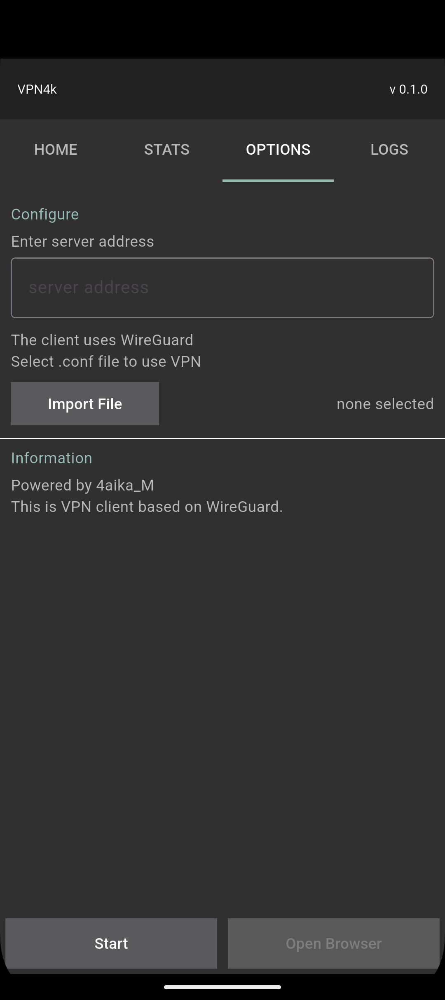
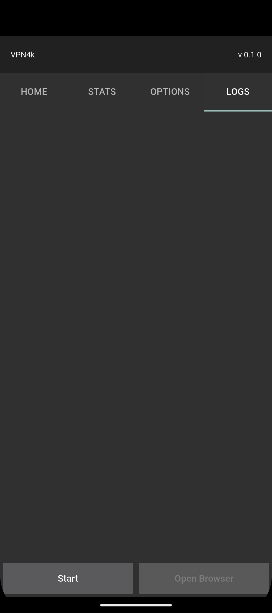

# vpn4k


A clean, minimalist VPN client built with Flutter. Securely connect to your WireGuard servers with real-time traffic monitoring, persistent configuration, and a beautiful, modern UI.

## Features

- **WireGuard Integration**: Seamless connect/disconnect functionality powered by `wireguard_flutter_plus`.
- **Real-time Traffic Statistics**: Monitor total upload/download data and current transfer speeds.
- **Live Traffic Charts**: Visualize your network activity with dynamic, real-time line charts using `fl_chart`.
- **Configuration Import**: Easily select and load `.conf` WireGuard configuration files.
- **Connection Logging**: Real-time stage tracking and logging for transparent connection status.
- **Persistent Settings**: Automatically saves your server address and last used configuration file path.
- **Responsive Design**: Adapts beautifully to both portrait and landscape orientations across mobile and desktop.
- **Material Design**: Modern, clean UI following Material Design principles.

## Screenshots

|  |  |
| :--: | :--: |
| *Home tab* | *Stats tab* |

|  |  |
| :--: | :--: |
| *Options tab* | *Logs tab* |

## Tech Stack

- **Framework**: Flutter 3.47.0
- **State Management**: Riverpod (flutter_riverpod 3.4.2)
- **UI**: Material Design 3
- **Architecture**: Clean, modular structure with providers and services
- **VPN Core**: wireguard_flutter_plus
- **Charting**: fl_chart
- **Storage**: shared_preferences
- **File Handling**: file_picker
- **Architecture**: Clean, modular structure with dedicated Notifiers, Services, and UI components.

## Getting Started

### Prerequisites

- Flutter SDK (3.47.0 or higher)
- Dart SDK
- Android Studio / VS Code
- A valid WireGuard .conf configuration file

### Installation

1.**Clone the repository**

```bash
git clone https://github.com/your-username/vpn4k.git
cd vpn4k
```

2.**Install dependencies**

```bash
flutter pub get
```

3.**Run the app**

```bash
flutter run
```

## Building for Release

### Android APK

```bash
flutter build apk --release
```

### Android App Bundle (for Play Store)

```bash
flutter build appbundle --release
```

## Project Structure

```text
lib/
├── main.dart         # App entry point and ProviderScope initialization
├── data/             # Services, repositories, exceptions
├── pages/            # UI screens
├── providers/        # State management
└── utils/            # Utility functions
```

## Contributing

1. Fork the project
2. Create your feature branch (`git checkout -b feature/AmazingFeature`)
3. Commit your changes (`git commit -m 'Add some AmazingFeature'`)
4. Push to the branch (`git push origin feature/AmazingFeature`)
5. Open a Pull Request

## License

This project is licensed under the MIT License - see the [LICENSE](LICENSE) file for details.

## Acknowledgments

- Built with Flutter and Dart
- VPN core powered by WireGuard and wireguard_flutter_plus
- Charting powered by fl_chart
- Inspired by clean, minimalist design principles
- Powered by 4aika_M
